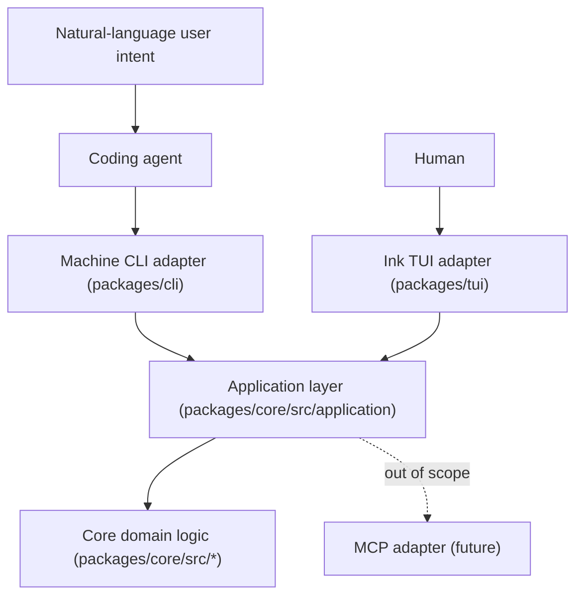

# Agent-Native Architecture

Corvus Skill Manager serves two kinds of caller:

- a **human**, through the existing Ink TUI;
- a **coding agent** (Codex, Claude Code, Gemini CLI, Copilot CLI, OpenCode, Pi Agent, …),
  through a deterministic machine JSON CLI.

Both callers must observe the same workflow semantics, the same safety rules, and the same
plan-then-apply confirmation model. That is only possible if neither adapter owns workflow
logic. This document defines the layer boundary that makes this true.

## Layers

### 1. Core domain logic — `packages/core/src/`

Config/lock/manifest schemas and stores, git inspection and skillpack setup, skill discovery,
link planning, link apply, status/doctor reports, path safety, self-update check.

Rules:

- pure and independently testable, with no knowledge of Ink, Commander, argv, or JSON envelopes;
- filesystem side effects isolated in small modules with explicit inputs;
- unchanged by the agent-native work except where new capability is genuinely additive
  (for example semantic registry v2 fields, which stay optional and backward compatible).

### 2. Application layer — `packages/core/src/application/`

High-level use cases that compose domain primitives into complete workflows:

- `capabilities`, `status`, `doctor`, `agents.list`;
- `skillpack.status`, `skillpack.setupPlan`, `skillpack.setupApply`,
  `skillpack.updateCheck`, `skillpack.updatePreview`, `skillpack.updateApply`;
- `skills.list`, `skills.search`, `skills.inspect`, `skills.validateRegistry`;
- read-only `listBundles`, `searchBundles`, and `inspectBundles` methods for future adapter
  presentation (machine commands and TUI screens are added in their dedicated phases);
- `install.plan`, `install.apply`, `install.verify`.

Rules:

- returns protocol-layer result types, never rendered strings and never Ink elements;
- never parses command lines — argv handling belongs to the CLI adapter;
- all side-effecting dependencies (home directory, clock, git runner, plan store, package
  runtime) are injected so tests can substitute doubles;
- pure request normalization is kept separate from filesystem and git effects;
- composes existing domain functions; it does not reimplement planning, discovery, or apply.

The application layer is the single seam an MCP adapter would later bind to. Adding MCP is
explicitly **out of scope** for this pass.

### 3. Ink TUI adapter — `packages/tui/`

Owns navigation, the Guided Flow wizard, previews, confirmations, and draft selection state.
A `CorvusApplication` is provided through React context (`CorvusApplicationContext`), so screens
call use cases instead of orchestrating core primitives. Protocol error codes are mapped to
human-readable sentences in `application/errorMessages.ts`; the TUI never renders raw protocol
JSON.

Screens on shared use cases today: Status (`status`), Doctor (`doctor`), Skill Discovery
(`discoverSkills`), and Manage Skillpacks (`skillpack.setup-*`, `skillpack.update-*`, and
`skillpack.remove-*`).

**Where the TUI still drives core primitives directly, and why.** The wizard's skillpack step
operates on an *unsaved, user-edited* skillpack form before it reaches `config.json`. There is no
equivalent use case for "inspect this hypothetical wizard draft", so that screen calls
`inspectSkillpackCheckout` / `inspectSkillpackRemoteUpdate` / `prepareSkillpackUpdatePreview` /
`applyInitialSkillpackSetup` / `applySkillpackUpdate` directly. Likewise the wizard's link
preview calls `generateLinkPlan` / `applyLinkPlan` directly, because the wizard expresses
per-agent *enable and disable* in one pass and the install request contract only expresses
installing for target agents.

This is not a second implementation. Those are the same shared engines the application layer
itself calls — `install.plan` delegates to `generateLinkPlan`, `install.apply` to
`applyLinkPlan`, `skillpack.setup-apply` to `applyInitialSkillpackSetup`. What differs is the
human-driven orchestration on top, which is the TUI's job. Equivalence is pinned by tests in
`packages/tui/src/application/equivalence.test.ts`, which assert that the wizard's planner
inputs and the machine `install plan` produce identical link operations for the same selection
and state.

### 4. Machine CLI adapter — `packages/cli/`

Owns the `corvus-skills` binary. With no arguments it launches the TUI exactly as before.
With a subcommand or `--help` it never initializes Ink. Its only responsibilities are:

- argv and request-document parsing (transport parsing);
- constructing the application service;
- serializing the protocol envelope to stdout and diagnostics to stderr;
- mapping the protocol error category to a process exit code.

Business logic in the CLI is forbidden. Transport parsing and serialization are permitted —
this replaces the older rule that the CLI may only start the TUI.

### 5. MCP adapter — out of scope

Not implemented in this pass. The application layer exists so that a later MCP server can
expose the same use cases without duplicating workflow logic.

## Out of scope, permanently or for this pass

- No embedded LLM, no AI API key requirement, no vendor-specific coupling. Semantic
  interpretation of user intent is the calling agent's job; Corvus executes deterministic
  operations only.
- No backend, Express server, cloud service, authentication layer, marketplace, or telemetry
  requirement.
- No copy fallback for links.
- No MCP adapter in this pass.

## Write boundaries (invariants, not UI conventions)

These hold for every adapter, including the machine CLI, and are enforced in the domain and
application layers rather than by any screen or prompt.

The manager may write **only**:

1. manager metadata under `~/.agents/corvus-skill-manager` (config, lock, manifest, plans);
2. immutable skillpack revision snapshots under
   `~/.agents/skillpacks/<id>/revisions/<commit>/repo`, plus the manager-owned
   `current -> revisions/<commit>/repo` link;
3. confirmed manager-owned symlinks/junctions inside configured agent target directories.

The manager must **never**:

- overwrite or modify an unmanaged file, directory, symlink, or junction — unsafe targets are
  skipped and reported, never replaced;
- remove anything not recorded as manager-owned in `manifest.json`;
- pull, reset, repair, format, commit, push, or edit the active skillpack checkout;
- write to registry files or skill files in a skillpack repository;
- mutate state from a read-only command (`status`, `doctor`, `agents list`,
  `skillpack status`, `skillpack update-check`, `skills *`, `install verify`) — including
  creating a default config as a side effect;
- treat `--json` as implicit authorization. Every mutation requires a write command plus an
  exact confirmation token matching a persisted plan.

## Plan-then-apply

Every write-capable agent workflow is two-phase:

1. a **plan** command produces a persisted, digest-identified plan artifact describing exactly
   the intended config mutation and ordered link operations, plus a fingerprint of the state it
   was computed against;
2. an **apply** command references that exact plan by ID and repeats the ID as an explicit
   `--confirm` token. Apply revalidates schema, digest, confirmation, and state fingerprint
   immediately before mutating, and executes only operations contained in the plan.

Stale state, tampered plans, and missing confirmation are rejected with stable machine error
codes. Corvus never auto-regenerates and silently applies a plan.

## Verification

`install verify` is strictly read-only and never repairs. It reports an objective status
(`verified`, `verified-no-op`, `partially-applied`, `drift-detected`, `blocked`) plus
actionable next steps, so a calling agent can conclude a workflow without parsing TUI output.
