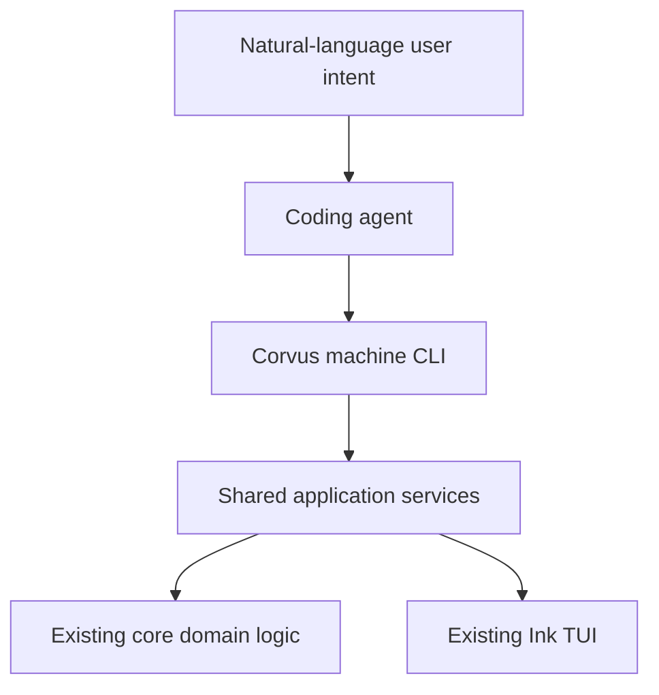

# Corvus Skill Manager — Agent-Native Interface and Intent-Based Skill Installation

## Implementation Task List

**Target repository:** `https://github.com/xiero/corvus-skill-manager`  
**Execution model:** sequential, implementation-ready, suitable for Codex autopilot  
**Primary goal:** preserve the existing Ink TUI while making Corvus Skill Manager a deterministic, safe, self-describing tool that Codex, Claude Code, Gemini CLI, Copilot CLI, OpenCode, Pi Agent, and other coding agents can operate without the user knowing Corvus commands.

---

## 1. Product outcome

After this work, a user should be able to tell an installed coding agent:

- “Use Corvus Skill Manager to install the whole compatible skillpack for yourself.”
- “Install `spec-unleashed` and `git-commit` for Codex and Claude Code.”
- “Install a balanced set of skills useful for embedded development.”
- “Install only the essential skills for React and Node web development.”

The agent must be able to discover the Corvus command contract, inspect the local state, set up the default skillpack when necessary, search and inspect the skill catalog, select exact skill IDs, generate a dry-run plan, apply the exact approved plan, verify the result, and report conflicts in structured form.

The intended operating model is:



The natural-language interpretation remains the responsibility of the calling agent. Corvus must not embed an LLM, require an AI API key, or become vendor-specific.

---

## 2. Non-negotiable constraints

1. Running `corvus-skills` with no arguments must continue to launch the existing Ink TUI.
2. Preserve the package dependency direction:
   - `@corvus-tools/skill-manager-core`
   - `@corvus-tools/skill-manager-tui` depends on core
   - `@corvus-tools/skill-manager` depends on TUI and core-facing application APIs as needed
3. Business logic must not be duplicated in the CLI or TUI.
4. The skill manager must not modify, pull, reset, repair, format, commit, push, or rewrite an active skillpack checkout.
5. Skillpack updates remain immutable-revision based and require preview before activation.
6. The manager must never overwrite unmanaged files, directories, symlinks, or junctions.
7. Removal is permitted only for links recorded as manager-owned in `manifest.json`.
8. Machine mode must never wait for keyboard input or render Ink components.
9. In JSON mode, `stdout` contains exactly one valid JSON document. Diagnostics and logs go to `stderr`.
10. All write-capable agent workflows must use plan-then-apply. Apply must reference the exact generated plan.
11. Do not add a backend, Express server, cloud service, authentication layer, marketplace, telemetry requirement, or copy fallback.
12. Do not add MCP in this implementation pass. The shared application layer must make a later MCP adapter straightforward, but JSON CLI support is the deliverable.
13. Do not publish npm packages, change npm ownership, or push releases unless separately requested.
14. Preserve existing user configuration, lock, manifest, revision, and TUI behavior through backward-compatible schema handling.

---

## 3. Agent execution instructions

Implement tasks in the specified order. Do not skip foundational protocol or safety tasks to reach the visible CLI sooner.

Before editing:

1. Inspect the repository state and existing tests.
2. Preserve unrelated local modifications.
3. Run the existing baseline:

   ```bash
   pnpm install
   pnpm build
   pnpm typecheck
   pnpm test
   ```

After each task:

1. Run the smallest relevant test subset.
2. Run `pnpm typecheck`.
3. Keep exported APIs documented and deterministic.
4. Update tests whenever an exported contract changes.

Before declaring the implementation complete:

```bash
pnpm build
pnpm typecheck
pnpm test
```

Do not silently relax a safety rule to make an end-to-end test pass. If a task conflicts with existing architecture or requires destructive behavior, stop and report the conflict.

---

## 4. Required command surface

The final CLI must support at least the following command families. Minor parser-level syntax adjustments are allowed only when they improve consistency and are reflected in help, schemas, and tests.

```text
corvus-skills
corvus-skills --help
corvus-skills capabilities --json
corvus-skills status --json
corvus-skills doctor --json

corvus-skills agents list --json

corvus-skills skillpack status --json
corvus-skills skillpack setup-plan [options] --json
corvus-skills skillpack setup-apply --plan-id <id> --confirm <id> --json
corvus-skills skillpack update-check --json
corvus-skills skillpack update-preview --json
corvus-skills skillpack update-apply --plan-id <id> --confirm <id> --json

corvus-skills skills list [--agent <id>] --json
corvus-skills skills search --query <text> [--agent <id>] [--limit <n>] --json
corvus-skills skills inspect <skill-id...> [--include-content] --json

corvus-skills install plan --agent <id...> --skill <id...> [options] --json
corvus-skills install plan --agent <id...> --all-compatible [options] --json
corvus-skills install apply --plan-id <id> --confirm <id> --json
corvus-skills install verify --plan-id <id> --json
```

Complex requests must additionally be accepted through a request document:

```text
--request <path>
--request -
```

`-` means read one JSON request document from stdin.

---

## 5. Machine protocol baseline

All JSON commands must use one versioned envelope:

```json
{
  "schemaVersion": 1,
  "ok": true,
  "command": "install.plan",
  "changed": false,
  "data": {},
  "warnings": [],
  "errors": [],
  "nextActions": []
}
```

Errors must contain stable codes in addition to human-readable messages:

```json
{
  "code": "UNMANAGED_TARGET_EXISTS",
  "category": "conflict",
  "message": "Target exists and is not manager-owned.",
  "retryable": false,
  "path": "/home/user/.agents/skills/example"
}
```

Minimum process exit-code contract:

| Exit code | Meaning |
|---:|---|
| `0` | Successful command, including an idempotent no-op |
| `2` | Invalid input, request, or schema |
| `3` | Conflict or unsafe target state |
| `4` | Explicit confirmation required or stale plan |
| `5` | Safety policy blocked the operation |
| `6` | External dependency, filesystem, git, or network failure |
| `7` | Unexpected internal failure |

The JSON error code is authoritative; numeric exit codes are broad categories.

---

## 6. Sequential task index

| ID | Task | Depends on |
|---|---|---|
| CSM-AI-001 | Baseline characterization and architecture contract | — |
| CSM-AI-002 | Versioned machine protocol types and error taxonomy | 001 |
| CSM-AI-003 | Shared application-service façade | 002 |
| CSM-AI-004 | CLI command router with no-argument TUI compatibility | 003 |
| CSM-AI-005 | Self-describing capabilities and AI-oriented help | 004 |
| CSM-AI-006 | Read-only status, doctor, and agent commands | 005 |
| CSM-AI-007 | Non-interactive skillpack setup and update workflows | 006 |
| CSM-AI-008 | Backward-compatible semantic registry v2 | 003 |
| CSM-AI-009 | Normalized discovery and dependency validation | 008 |
| CSM-AI-010 | Deterministic catalog, search, and inspect services | 009 |
| CSM-AI-011 | Intent-aware install request contract | 010 |
| CSM-AI-012 | High-level exact and all-compatible install planning | 011 |
| CSM-AI-013 | Persistent plan artifacts, digest, and state fingerprint | 012 |
| CSM-AI-014 | Safe non-interactive install apply | 013 |
| CSM-AI-015 | Verification, idempotency, and recovery reporting | 014 |
| CSM-AI-016 | Move TUI orchestration onto shared application services | 015 |
| CSM-AI-017 | Agent workflow documentation and examples | 016 |
| CSM-AI-018 | Default skillpack semantic metadata migration support | 010 |
| CSM-AI-019 | End-to-end contract and regression test suite | 017, 018 |
| CSM-AI-020 | Final compatibility, packaging, and release-readiness pass | 019 |

---

# 7. Detailed tasks

## CSM-AI-001 — Baseline characterization and architecture contract

### Goal

Record the current behavior before introducing a second interface, and define the architectural boundary that both the Ink TUI and machine CLI must follow.

### Implementation

1. Run and record the existing build, typecheck, and test baseline.
2. Identify all current TUI workflows that call core APIs:
   - initial config creation/loading;
   - skillpack inspection and initial setup;
   - remote update check, preview, and activation;
   - agent configuration;
   - skill discovery;
   - link planning;
   - link application;
   - status and doctor reports.
3. Add `docs/agent-native-architecture.md` describing:
   - core domain logic;
   - shared application/use-case layer;
   - Ink TUI adapter;
   - machine CLI adapter;
   - later, out-of-scope MCP adapter.
4. Update `architecture.md` to replace the obsolete rule that the CLI can only start the TUI. The new rule must allow transport parsing and serialization in CLI while continuing to forbid business logic there.
5. Document the write boundaries and no-silent-overwrite guarantees as invariants, not UI conventions.

### Acceptance criteria

- Current tests pass before functional edits begin.
- The architecture explicitly states that TUI and machine CLI call the same use cases.
- No existing runtime behavior changes in this task.
- MCP, an embedded LLM, backend services, and cloud dependencies are explicitly out of scope.

### Tests

- Documentation-only task; run existing `pnpm typecheck` and `pnpm test` as regression checks.

---

## CSM-AI-002 — Versioned machine protocol types and error taxonomy

### Goal

Create one stable, testable JSON protocol shared by every machine command.

### Suggested location

```text
packages/core/src/application/protocol/
  envelope.ts
  errors.ts
  exitCodes.ts
  nextActions.ts
```

### Implementation

1. Define Zod schemas and inferred TypeScript types for:
   - success and failure envelopes;
   - warnings;
   - machine errors;
   - next actions;
   - command identity;
   - schema version.
2. Define a stable symbolic error taxonomy. Include at least:
   - `INVALID_REQUEST`;
   - `CONFIG_NOT_FOUND`;
   - `CONFIG_INVALID`;
   - `SKILLPACK_NOT_CONFIGURED`;
   - `SKILLPACK_NOT_READY`;
   - `SKILL_NOT_FOUND`;
   - `SKILL_NOT_SUPPORTED_BY_AGENT`;
   - `UNKNOWN_AGENT`;
   - `AGENT_TARGET_REQUIRED`;
   - `UNMANAGED_TARGET_EXISTS`;
   - `PLAN_NOT_FOUND`;
   - `PLAN_CONFIRMATION_REQUIRED`;
   - `PLAN_DIGEST_MISMATCH`;
   - `STALE_PLAN`;
   - `SAFETY_POLICY_BLOCKED`;
   - `EXTERNAL_OPERATION_FAILED`;
   - `INTERNAL_ERROR`.
3. Create a single mapping from machine error category to process exit code.
4. Add deterministic serializers. Omit optional fields consistently; never emit `undefined`.
5. Ensure JSON-safe error conversion does not expose stack traces by default. Stack traces may be written to `stderr` only in an explicit debug mode.
6. Export protocol types from the core public entrypoint.

### Acceptance criteria

- Every envelope validates against a Zod schema.
- The same error code always maps to the same exit-code category.
- Serialization is deterministic for equivalent input.
- No UI-specific strings or Ink types exist in the protocol layer.

### Tests

- Schema validation tests for success and failure envelopes.
- Golden serialization tests.
- Exit-code mapping tests.
- Unknown-error sanitization tests.

---

## CSM-AI-003 — Shared application-service façade

### Goal

Introduce high-level use cases that orchestrate existing core primitives so neither TUI nor CLI must reproduce workflow logic.

### Suggested location

```text
packages/core/src/application/
  CorvusApplication.ts
  createCorvusApplication.ts
  ports.ts
  useCases/
```

### Implementation

1. Define a `CorvusApplication` interface with high-level operations for:
   - capabilities;
   - status;
   - doctor;
   - agent listing;
   - skillpack status/setup/update;
   - skill list/search/inspect;
   - installation planning/apply/verification.
2. Implement a factory with dependency injection for:
   - home directory;
   - current time;
   - filesystem-facing stores;
   - git runner;
   - package runtime information;
   - plan store.
3. Compose existing functions such as config loading, skill discovery, status building, doctor building, link planning, and link application. Do not reimplement them.
4. Return protocol-layer result types rather than rendered strings.
5. Keep pure request normalization separate from filesystem and git side effects.
6. Export the application interface and factory from `packages/core/src/index.ts`.

### Acceptance criteria

- Application services can be tested without Ink and without spawning the CLI.
- Core domain functions remain independently testable.
- Side-effecting dependencies can be replaced with test doubles.
- No command-line parsing exists in core.

### Tests

- Application service unit tests with temporary directories and stubbed git runner.
- Failure translation tests from domain errors to machine error codes.

---

## CSM-AI-004 — CLI command router with no-argument TUI compatibility

### Goal

Turn the current binary into a dual-mode entrypoint: existing TUI for humans and command router for agents.

### Suggested structure

```text
packages/cli/src/
  index.ts
  tuiLauncher.ts
  cli/
    createProgram.ts
    executeCommand.ts
    output.ts
    requestInput.ts
```

### Implementation

1. Move the current Ink launch behavior into a dedicated `tuiLauncher.ts` without changing rendering behavior.
2. Introduce a mature command parser in the CLI package. Commander is acceptable; avoid custom ad-hoc argument parsing.
3. Route based on arguments:
   - no arguments: launch TUI;
   - `--help` or a subcommand: do not initialize Ink;
   - machine command: construct the application service and execute it.
4. Implement `--json`, `--debug`, and request-file/stdin plumbing.
5. In `--json` mode:
   - disable color and ANSI output;
   - never clear the terminal;
   - never prompt;
   - write one JSON object to stdout;
   - write optional diagnostics only to stderr.
6. Handle SIGINT and unexpected failures with a stable machine error envelope where possible.

### Acceptance criteria

- `corvus-skills` still launches the current TUI.
- `corvus-skills --help` does not clear the terminal or initialize Ink.
- A JSON command does not import or render the TUI execution path at runtime.
- Stdin request parsing rejects empty, multiple, or invalid JSON documents cleanly.

### Tests

- CLI process tests for no-argument routing and help routing.
- Parseable stdout tests for `--json`.
- Tests asserting no ANSI escape sequences in JSON mode.
- Tests asserting diagnostics do not contaminate stdout.

---

## CSM-AI-005 — Self-describing capabilities and AI-oriented help

### Goal

Allow an arbitrary coding agent to learn how to operate an installed Corvus binary without external documentation.

### Implementation

1. Add `corvus-skills capabilities --json`.
2. Return:
   - manager package/version information;
   - machine protocol version;
   - supported commands;
   - whether each command is read-only or write-capable;
   - required confirmation model;
   - supported agent adapters;
   - supported request formats;
   - registry contract versions;
   - relevant default paths;
   - exit-code categories;
   - machine-readable input schema or schema identifiers for each command.
3. Add an AI quick-start line near the top of `corvus-skills --help`:

   ```text
   For coding agents: corvus-skills capabilities --json
   ```

4. Keep capability output concise and deterministic. Do not include current timestamps unless explicitly requested.
5. Add `nextActions` that guide an agent toward `status`, then skillpack readiness, then discovery/planning.

### Acceptance criteria

- A coding agent needs only the binary name and `capabilities --json` to discover the supported workflow.
- Capability output does not depend on an initialized skillpack.
- Supported agents are derived from the adapter registry rather than duplicated constants.

### Tests

- Capability schema and golden output tests.
- Test that every advertised command is registered by the CLI parser.
- Test that read/write classification exists for every command.

---

## CSM-AI-006 — Read-only status, doctor, and agent commands

### Goal

Expose current diagnostic information to agents without requiring TUI parsing.

### Implementation

1. Add:
   - `status --json`;
   - `doctor --json`;
   - `agents list --json`;
   - `skillpack status --json`.
2. Wrap the existing structured status and doctor reports without losing fields.
3. Return stable machine codes for doctor issues.
4. Include agent adapter metadata:
   - id;
   - display name;
   - support status;
   - default target path;
   - configured target path;
   - enabled state;
   - selected skill IDs.
5. Ensure all these commands are strictly read-only, including no default config creation as a side effect. If the config is absent, report it structurally.
6. Emit actionable `nextActions`, for example skillpack setup when the active snapshot is missing.

### Acceptance criteria

- Commands work with missing, valid, and invalid configuration states.
- No files or directories are created by read-only commands.
- Agent ordering and issue ordering are deterministic.

### Tests

- Temporary-home tests that compare the directory tree before and after read-only commands.
- Missing/invalid config tests.
- Stable ordering tests.

---

## CSM-AI-007 — Non-interactive skillpack setup and update workflows

### Goal

Let an agent prepare the default or explicitly supplied skillpack using the existing immutable revision model.

### Implementation

1. Add machine use cases and commands for:
   - skillpack setup planning;
   - initial setup application;
   - update check;
   - update preview;
   - approved revision activation.
2. Reuse the current default skillpack source when none is specified.
3. Setup planning must return the intended repository, branch, skillpack ID, active path, and revision path before any clone occurs.
4. Setup apply must require a persisted plan ID and matching `--confirm` value.
5. Update check remains read-only.
6. Update preview may create only an inactive immutable revision snapshot, matching the current safety model.
7. Update activation must require the exact preview/activation plan and reject remote/head drift.
8. Never run `git pull` against the active checkout.
9. Never rewrite registry or skill files.

### Acceptance criteria

- A first-run agent can safely make the default skillpack available without opening the TUI.
- Existing active revisions are inspected, not repaired or overwritten.
- Update activation changes only the manager-owned `current` link and appropriate manager metadata.
- Re-running successful setup is an idempotent no-op.

### Tests

- Stubbed git tests for initial clone, existing revision, missing remote, and changed remote head.
- Tests proving active checkout mutation commands are never invoked.
- Plan-confirmation and stale-update tests.

---

## CSM-AI-008 — Backward-compatible semantic registry v2

### Goal

Enrich the registry so agents can discover skills by domain, task, language, technology, and use case without breaking existing registry files.

### Required v2 skill metadata

Keep existing fields and add optional semantic and relationship fields:

```json
{
  "id": "embedded-driver-development",
  "path": "skills/embedded-driver-development",
  "title": "Embedded Driver Development",
  "description": "Helps implement and review embedded C/C++ drivers.",
  "supportedAgents": ["codex", "claude"],
  "tags": ["firmware"],
  "domains": ["embedded", "firmware"],
  "tasks": ["driver-development", "debugging", "code-review"],
  "languages": ["c", "cpp"],
  "technologies": ["cmake", "gcc", "stm32"],
  "platforms": ["bare-metal", "rtos"],
  "keywords": ["hal", "registers", "interrupts", "peripherals"],
  "useCases": ["Implement a new peripheral driver"],
  "nonGoals": ["General-purpose web application development"],
  "requires": [],
  "recommends": ["embedded-testing"],
  "conflictsWith": []
}
```

### Implementation

1. Model registry v1 and v2 explicitly with Zod.
2. Treat a missing registry version using the existing backward-compatible behavior.
3. Keep current v1 entries valid without modification.
4. Normalize optional arrays to empty arrays in the discovered runtime model.
5. Validate each metadata value:
   - non-empty trimmed strings;
   - bounded array sizes and string lengths;
   - deduplicated values using a documented case-normalization rule.
6. Keep the registry strict enough to detect misspelled fields.
7. Export versioned schemas and types.
8. Update `docs/skillpack-contract.md` with v1/v2 examples and migration guidance.

### Acceptance criteria

- Existing registry and registryless discovery tests continue to pass.
- A v2 registry exposes normalized semantic metadata on `DiscoveredSkill`.
- Invalid metadata produces structured discovery errors with skill IDs and field paths.
- No manager code writes changes back into the registry.

### Tests

- v1 compatibility fixtures.
- valid and invalid v2 fixtures.
- duplicate and normalization tests.
- strict unknown-field tests.

---

## CSM-AI-009 — Normalized discovery and dependency validation

### Goal

Extend discovery so semantic search and safe installation receive complete, validated skill models.

### Implementation

1. Extend `DiscoveredSkill` with every normalized semantic field.
2. Preserve registryless fallback:
   - title/name/description from frontmatter;
   - default Codex support;
   - `registryless` tag;
   - empty semantic/relationship arrays.
3. After loading all skills, validate relationships:
   - `requires` targets must exist;
   - `conflictsWith` targets must exist;
   - missing `recommends` targets produce warnings rather than blocking discovery;
   - self-dependencies and self-conflicts are invalid;
   - required dependency cycles are invalid.
4. Add compatibility helpers such as:
   - `isSkillSupportedByAgent`;
   - `expandRequiredDependencies`;
   - `findSkillConflicts`.
5. Required dependencies must be expanded deterministically and retain a reason such as `dependency-of:<skill-id>`.
6. Recommendations are exposed to the calling agent but are not automatically installed.

### Acceptance criteria

- Discovery results are sufficient for catalog, search, planning, and explanation without re-reading registry JSON.
- Dependency expansion is stable and cycle-safe.
- Unsupported required dependencies block planning with a structured error.
- Risk warnings remain attached to individual skills.

### Tests

- Missing dependency, cycle, self-reference, recommendation warning, and conflict fixtures.
- Deterministic dependency expansion tests.
- Agent compatibility tests.

---

## CSM-AI-010 — Deterministic catalog, search, and inspect services

### Goal

Give agents token-efficient access to the skill catalog while leaving final semantic selection to the calling agent.

### Implementation

1. Add application services and commands for:
   - `skills list`;
   - `skills search`;
   - `skills inspect`.
2. `skills list` must support optional agent compatibility filtering.
3. `skills search` must use deterministic local lexical ranking only. Do not call an LLM, embedding service, or network search.
4. Implement normalized matching across weighted fields. Use a documented weighting order similar to:
   - exact skill ID/title match: highest;
   - domains and tasks;
   - languages, technologies, and platforms;
   - keywords and tags;
   - description and use cases;
   - non-goals as a negative signal.
5. Return for each candidate:
   - normalized metadata;
   - compatibility state;
   - deterministic score;
   - matched fields/terms;
   - risk warnings;
   - requires/recommends/conflicts.
6. Stable tie-breaker must be skill ID.
7. Support a bounded `--limit`; reject unreasonable values.
8. `skills inspect` returns full normalized metadata. `--include-content` may additionally return `SKILL.md` content for explicitly named skills only.
9. Preserve output order and avoid current timestamps.

### Acceptance criteria

- An agent can translate “embedded development” into search terms such as `embedded firmware c cpp cmake stm32 debugging`, inspect top candidates, and choose exact IDs.
- Search results explain why each result matched.
- Repeated search over the same snapshot returns byte-stable JSON when formatted canonically.
- No semantic choice is made invisibly by Corvus.

### Tests

- Ranking fixtures for embedded, web, testing, and documentation queries.
- Agent compatibility filter tests.
- Stable score/tie ordering tests.
- `include-content` opt-in tests.

---

## CSM-AI-011 — Intent-aware install request contract

### Goal

Standardize how a coding agent hands its exact selection and original user intent to Corvus.

### Request model

Support at least:

```json
{
  "schemaVersion": 1,
  "intent": "Install a balanced skill set for embedded development",
  "selectionPolicy": "balanced",
  "targetAgents": ["codex"],
  "selectedSkills": [
    {
      "id": "embedded-driver-development",
      "reason": "Relevant to embedded C/C++ driver implementation."
    },
    {
      "id": "embedded-testing",
      "reason": "Adds unit-testing and hardware abstraction guidance."
    }
  ]
}
```

### Implementation

1. Define `minimal`, `balanced`, and `complete` selection-policy values.
2. Treat `selectionPolicy` and per-skill reasons as provenance/audit data. Corvus does not invoke AI to enforce subjective relevance.
3. Require exact target agent IDs and exact selected skill IDs by planning time.
4. Allow repeated CLI flags and JSON request files/stdin.
5. Normalize duplicate target agents and skill IDs deterministically.
6. Validate bounded intent/reason lengths.
7. Support either:
   - explicit `selectedSkills`; or
   - `allCompatible: true`;
   - never both.
8. Keep the request contract versioned independently from internal TypeScript types.

### Acceptance criteria

- The same normalized request is produced from equivalent CLI flags and JSON input.
- Ambiguous display names are not silently converted to skill IDs.
- An empty explicit selection is a valid no-op plan only when deliberately supplied; accidental missing selection is rejected.

### Tests

- CLI/request-file equivalence tests.
- Duplicate normalization tests.
- mutually exclusive explicit/all-compatible tests.
- size and invalid-agent validation tests.

---

## CSM-AI-012 — High-level exact and all-compatible install planning

### Goal

Produce one complete installation plan from an agent’s exact selection while preserving current config, discovery, manifest, and link safety rules.

### Implementation

1. Add an `install.plan` use case that:
   - loads config without unexpected writes;
   - verifies the active skillpack is ready;
   - discovers skills;
   - validates target agents;
   - expands required dependencies;
   - validates conflicts;
   - filters or blocks unsupported skills;
   - loads previous selections;
   - inspects current target states;
   - calls the existing deterministic link planner;
   - produces intended config changes plus link operations.
2. For explicit selections, an unsupported skill/agent combination must be a blocking error, not silently skipped.
3. For `--all-compatible`, include every discovered skill supporting each target agent, then expand dependencies and report exclusions.
4. Preserve existing skills selected for unrelated agents.
5. Define whether explicit install is additive or replacement. Required behavior:
   - default is additive for the targeted agents;
   - add `--replace-selection` only for intentional replacement;
   - replacement must clearly list removals and retain normal manager-owned removal safeguards.
6. Include a plan summary:
   - creates;
   - removals;
   - already satisfied;
   - dependencies added;
   - recommendations not selected;
   - conflicts;
   - risk warnings;
   - config changes.
7. Planning itself must remain read-only except for writing the manager-owned plan artifact introduced in the next task.

### Acceptance criteria

- Exact skill installs and whole compatible skillpack installs are both supported.
- Additive installation never removes an existing selected skill.
- Replacement mode shows every removal before apply.
- Existing `generateLinkPlan` safety behavior remains authoritative.

### Tests

- Exact selection, multiple agents, all-compatible, additive, replacement, dependency, unsupported skill, and unmanaged conflict tests.

---

## CSM-AI-013 — Persistent plan artifacts, digest, and state fingerprint

### Goal

Ensure apply executes exactly the reviewed plan and rejects plans made against stale local state.

### Storage

Use a manager-owned directory such as:

```text
~/.agents/corvus-skill-manager/plans/<plan-id>.json
```

### Plan requirements

Each persisted plan must contain:

- plan schema version;
- plan kind;
- deterministic plan ID/digest;
- normalized request and intent provenance;
- target agents and selected skills;
- intended config mutation;
- ordered link operations;
- warnings and conflicts;
- confirmation requirement;
- state fingerprint inputs;
- creation time for audit, excluded from deterministic digest calculation.

### Implementation

1. Canonicalize the digest-bearing plan payload and hash it using SHA-256.
2. Use the digest as or inside `planId`.
3. Fingerprint all state that could invalidate apply:
   - relevant normalized config;
   - manifest content;
   - active skillpack commit/revision;
   - selected skill metadata needed by the plan;
   - inspected target states.
4. Persist plan files atomically inside the manager state directory.
5. Validate loaded plan files against a strict Zod schema.
6. Reject path traversal and arbitrary external plan IDs.
7. `apply --plan-id X --confirm X` must fail if:
   - plan is absent or invalid;
   - digest does not match content;
   - confirmation does not match;
   - current state fingerprint differs.
8. Return `STALE_PLAN` with enough structured information for the agent to regenerate the plan, but do not auto-regenerate and apply silently.

### Acceptance criteria

- Equivalent state and request generate the same digest-bearing payload.
- Editing a stored plan invalidates its digest.
- Changing config, manifest, active revision, or a target path invalidates the plan.
- Plan storage never escapes the manager state directory.

### Tests

- Canonicalization and digest fixtures.
- Tampering tests.
- Stale config/manifest/revision/target tests.
- Atomic write and invalid-path tests.

---

## CSM-AI-014 — Safe non-interactive install apply

### Goal

Apply the exact persisted plan without TUI interaction while retaining all ownership and overwrite protections.

### Implementation

1. Add `install apply --plan-id <id> --confirm <id> --json`.
2. Revalidate plan schema, digest, confirmation, state fingerprint, source paths, target paths, and manifest ownership immediately before mutation.
3. Apply intended configuration and link operations through existing stores and `applyLinkPlan`; do not implement a second link engine.
4. Define and document operation ordering so partial failures remain recoverable and visible.
5. Preserve manager-owned manifest invariants.
6. Return per-operation results using stable codes:
   - applied;
   - already satisfied;
   - skipped safely;
   - blocked;
   - failed.
7. Treat an already satisfied plan as successful with `changed: false`.
8. Never interpret `--json` as implicit permission. Mutation requires both the write command and exact confirmation token.
9. Do not create prompts in machine mode.

### Acceptance criteria

- A user’s explicit natural-language install request can be executed by an agent through plan plus confirmed apply without another TUI step.
- Corvus still refuses unmanaged conflicts and unsafe removals.
- Apply never executes operations not contained in the persisted plan.
- Re-running apply is safe and produces a structured no-op/already-satisfied result.

### Tests

- Successful additive install.
- Multiple-agent install.
- Idempotent second apply.
- Broken managed link confirmation behavior.
- Unmanaged file/directory/symlink conflict.
- Stale and tampered plan rejection.
- Simulated partial operation failure reporting.

---

## CSM-AI-015 — Verification, idempotency, and recovery reporting

### Goal

Let the calling agent prove that installation succeeded and provide useful recovery actions when it did not.

### Implementation

1. Add `install verify --plan-id <id> --json`.
2. Verify:
   - expected selected skills are stored in config;
   - expected manager-owned links exist;
   - link targets resolve to the active skillpack through `current`;
   - manifest ownership matches;
   - no planned removals remain;
   - required dependencies are installed;
   - doctor does not report new blocking issues for affected entries.
3. Return a verification status:
   - `verified`;
   - `verified-no-op`;
   - `partially-applied`;
   - `drift-detected`;
   - `blocked`.
4. Return precise `nextActions` such as regenerate plan, resolve unmanaged target, inspect skillpack, or rerun doctor.
5. Never repair automatically from verify.

### Acceptance criteria

- A coding agent can finish every install workflow with an objective verification result.
- Verification is strictly read-only.
- Partial apply and later drift are distinguishable.

### Tests

- Verified, no-op, missing link, wrong target, stale manifest, and partial apply cases.
- Read-only filesystem-tree comparison test.

---

## CSM-AI-016 — Move TUI orchestration onto shared application services

### Goal

Ensure human and agent interfaces use the same workflow semantics while keeping the existing TUI behavior and appearance.

### Implementation

1. Replace screen-level orchestration of core primitives with `CorvusApplication` calls where an equivalent use case exists.
2. Preserve:
   - Home menu;
   - Guided Flow order;
   - existing preview screens;
   - explicit `a` approval behavior;
   - Status, Doctor, Help, and advanced screens;
   - no-argument startup.
3. Keep draft UI state in the TUI, but route plan/apply semantics through application services.
4. Reuse protocol/domain error codes and map them to human-readable UI messages.
5. Do not make the TUI render raw JSON.
6. Remove duplicated orchestration only after equivalent tests exist.

### Acceptance criteria

- TUI snapshots/behavior remain stable except for intentionally improved error wording.
- TUI and CLI produce equivalent plans for equivalent selections and state.
- There is one implementation of setup, discovery, planning, apply, and verification semantics.

### Tests

- Existing Ink tests remain green.
- Add equivalence tests comparing TUI-invoked and CLI-invoked application results.
- Add a no-argument TUI smoke test after CLI routing changes.

---

## CSM-AI-017 — Agent workflow documentation and examples

### Goal

Document exactly how a generic coding agent should operate Corvus and when it should ask the user for clarification.

### Files

```text
docs/agent-interface.md
docs/agent-protocol-v1.md
docs/semantic-registry.md
docs/examples/agent-install-requests.json
```

### Implementation

1. Add an “AI agents” section to the README with the discovery entrypoint.
2. Document the recommended agent algorithm:
   1. locate `corvus-skills`;
   2. call capabilities;
   3. call status;
   4. make the skillpack ready if needed;
   5. search/list/inspect skills;
   6. choose exact IDs;
   7. plan;
   8. inspect conflicts and warnings;
   9. apply with exact confirmation;
   10. verify and report.
3. Document authorization behavior:
   - an explicit user request to install authorizes normal additive manager-owned links;
   - ask again for ambiguous target identity, unmanaged conflicts, replacement/removal, or revision activation not clearly requested;
   - never silently bypass safety blocks.
4. Include end-to-end examples for:
   - selected skills;
   - all compatible skills;
   - embedded-development intent;
   - React/Node web-development intent;
   - multiple target agents;
   - conflict recovery;
   - first-run skillpack setup.
5. State clearly that the calling agent performs semantic interpretation and Corvus executes deterministic operations.

### Acceptance criteria

- Examples match real CLI syntax and validate against request schemas.
- No documentation instructs agents to parse TUI output.
- No example uses unsafe overwrite or active-checkout mutation.

### Tests

- Add documentation fixture tests where practical so example JSON parses against the public schemas.
- Add a help-output snapshot test.

---

## CSM-AI-018 — Default skillpack semantic metadata migration support

### Goal

Make intent-based discovery useful with real skillpacks, including the default Corvus skill collection, without allowing the manager to mutate those repositories.

### Scope boundary

The manager repository must provide the contract, validator, examples, fixtures, and migration tooling/documentation. Actual metadata edits in `xiero/skill-collection` belong in that repository and require its checkout or a separate authorized task.

### Implementation

1. Add a read-only registry validation command:

   ```text
   corvus-skills skills validate-registry --json
   ```

2. Report:
   - registry version;
   - invalid entries;
   - missing semantic metadata;
   - unknown relationship targets;
   - cycles;
   - coverage statistics by field.
3. Add representative v2 fixtures containing embedded, web, testing, documentation, and general-development skills.
4. Add a migration guide for skillpack maintainers.
5. If the default `xiero/skill-collection` repository is available in the same authorized workspace, migrate its registry by inspecting every skill individually. Do not fabricate metadata from filenames alone.
6. If that repository is not available, produce a separate follow-up checklist and keep manager tests fixture-based.

### Acceptance criteria

- Intent search works meaningfully against representative v2 fixtures.
- The manager remains read-only toward registry and skill files.
- Registry validation can be used in skillpack CI.

### Tests

- Valid/invalid registry command tests.
- Coverage report tests.
- No-write test for validation.

---

## CSM-AI-019 — End-to-end contract and regression test suite

### Goal

Prove that the product-level natural-language scenarios can be completed by an agent through the machine interface while the human TUI remains intact.

### Implementation

1. Add CLI process-level tests using isolated temporary HOME directories.
2. Cover these scenarios:
   - capabilities discovery on a fresh machine;
   - missing config and missing skillpack;
   - default skillpack setup planning/application with stubbed git;
   - exact skill install for Codex;
   - exact skills for Codex and Claude;
   - all-compatible install;
   - semantic search followed by explicit selected IDs;
   - dependency expansion;
   - unsupported skill/agent pair;
   - unmanaged target conflict;
   - stale plan;
   - tampered plan;
   - idempotent second apply;
   - verify success and drift;
   - invalid JSON request;
   - non-TTY/no-prompt behavior;
   - TUI launch with no arguments.
3. Add golden JSON fixtures for the public protocol. Normalize temp paths before snapshot comparison.
4. Assert that every machine command:
   - emits one JSON document;
   - uses the envelope schema;
   - emits no ANSI;
   - exits with the documented category;
   - does not prompt.
5. Test Linux symlink and Windows junction path semantics at the unit level using injected platform/path behavior where direct cross-platform execution is unavailable.
6. Keep network-independent CI through fixtures and stubbed git operations.

### Acceptance criteria

- All documented product scenarios are represented by executable tests.
- Existing core and TUI regression tests remain green.
- CI does not require access to GitHub, npm, or an LLM.

### Verification

```bash
pnpm build
pnpm typecheck
pnpm test
```

---

## CSM-AI-020 — Final compatibility, packaging, and release-readiness pass

### Goal

Finish the implementation in a state suitable for a later npm release without publishing it.

### Implementation

1. Audit public exports and package `files` declarations so new runtime files, schemas, and type declarations are included.
2. Verify the built global package supports:

   ```bash
   pnpm --filter @corvus-tools/skill-manager exec corvus-skills --help
   pnpm --filter @corvus-tools/skill-manager exec corvus-skills capabilities --json
   ```

3. Pack all three npm packages locally and inspect tarball contents.
4. Install the packed CLI into a temporary prefix and run smoke tests without workspace resolution.
5. Confirm package dependency versions resolve correctly in publish order: core, TUI, CLI.
6. Review README, architecture, skillpack contract, safety model, managed-manifest documentation, and agent protocol for contradictions.
7. Add a changelog/release-note draft describing:
   - preserved TUI;
   - machine JSON CLI;
   - intent-oriented catalog/search;
   - exact and all-compatible installs;
   - plan/apply confirmation;
   - registry v2;
   - backward compatibility.
8. Do not publish or push a release.

### Acceptance criteria

- Local packed installation works without monorepo-only resolution.
- No-argument TUI and machine commands both work from the packed CLI.
- Build, typecheck, and all tests are green.
- Documentation and capability output match implemented behavior.
- No release or external write has occurred.

---

# 8. Final definition of done

The project is complete only when all of the following are true:

1. Existing users can still run `corvus-skills` and use the TUI as before.
2. An arbitrary coding agent can discover the machine interface using `capabilities --json`.
3. Read-only commands never mutate local state.
4. The agent can safely initialize the default skillpack when absent.
5. Registry v1 and registryless skillpacks still work.
6. Registry v2 supports domain/task/language/technology/platform/use-case metadata and skill relationships.
7. The agent can list, search, and inspect skills using deterministic JSON results.
8. The agent can install exact skills for one or more target agents.
9. The agent can install the whole compatible skillpack.
10. The agent can interpret a broad intent such as embedded or web development, choose exact skill IDs, and pass those IDs with reasons to Corvus.
11. Corvus never embeds an LLM or makes an invisible semantic choice.
12. Every write uses a persisted plan, digest confirmation, current-state validation, and existing ownership protections.
13. Apply is idempotent and verification is read-only.
14. Unmanaged conflicts, stale plans, unsupported skills, and partial failures are reported with stable machine codes and actionable next steps.
15. Human TUI and machine CLI use the same application services.
16. Package-level and process-level tests cover the complete workflow.
17. The packed npm CLI works locally, but no release is published automatically.

---

# 9. Expected agent handoff summary

When implementation is complete, report:

- files and modules added or changed;
- public command surface;
- protocol/schema versions;
- safety invariants preserved;
- registry compatibility behavior;
- test commands and results;
- packed-package smoke-test results;
- any deferred cross-repository metadata work;
- any known limitations;
- confirmation that no npm publish or remote release was performed.

